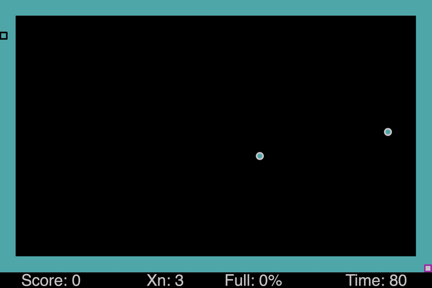

<h3 align="center">Xonix - javascript remake of the legend. Сlick on the picture to play!👾</h3>

  

## About the game
Originally made by Ilan Raab and Dani Katz in 1984 for MS-DOS platform.
The essence of the game is to capture the dark field without falling into the enemies.
When more than 70 percent is captured, you will move to the next level. 
But be careful! You only have three lives and 80 seconds to do it. 
For each level you get points, the task - to score as many points, as you can.
Good luck!🤞

## Game control
* At the beginning of the game, a purple square appears in the lower right corner - you control this little guy
* To move, you can use the arrows or swipes (yes, you can play from your smartphone too!)
* If you are tired or mom calls you to dinner, you can just press the space bar and the game will stop
